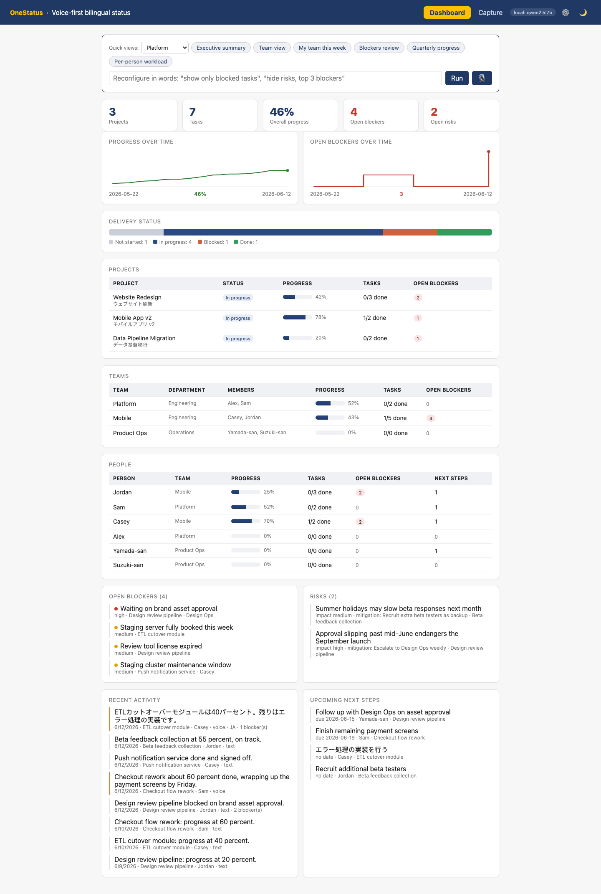
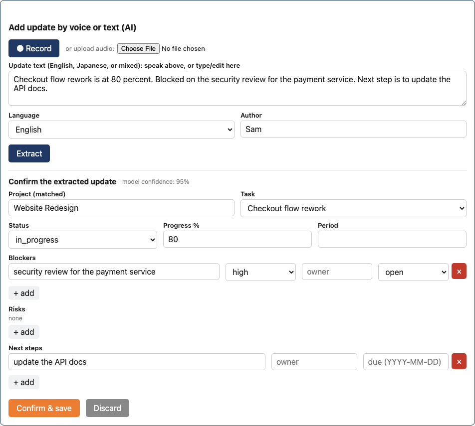
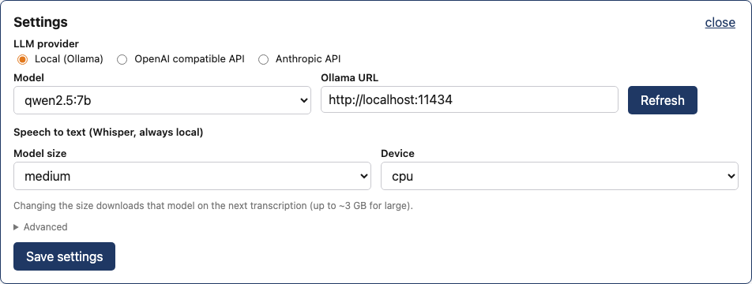
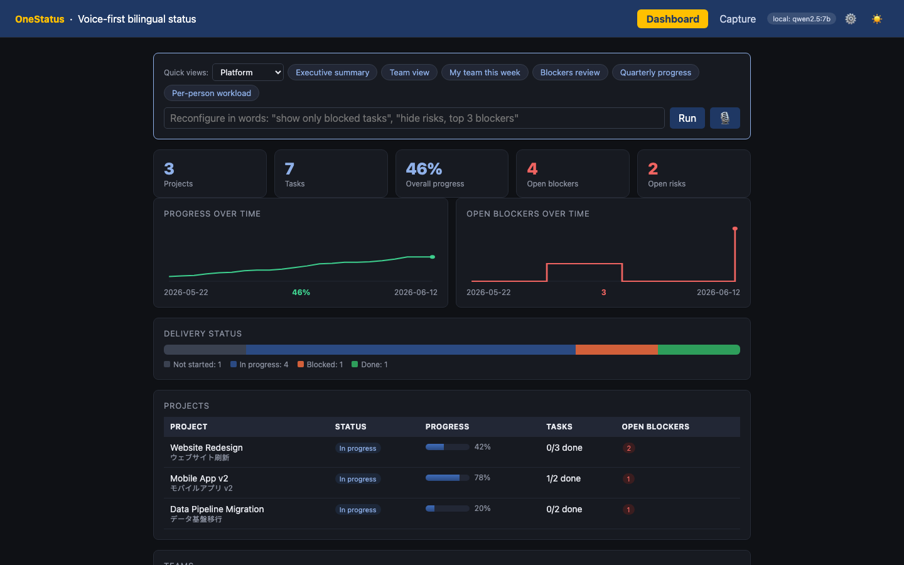

# Sony OneStatus

Voice-first bilingual project status tracker.

Engineers speak or type status updates in English, Japanese, or a mix. A language model
turns each update into a structured record (status, progress, blockers, risks, next
steps), a human confirms it on a review screen, and managers get a live dashboard they
can reshape with plain-language requests. Speech-to-text always runs locally
(faster-whisper). Extraction runs on a local model by default (Ollama) or through a
cloud API key, switchable live from the settings panel; a header badge always shows
which mode is active.

## What it does

- Capture by voice (record in the browser or upload a clip) or by text, in EN and JA
- LLM extraction into a draft: project, task, status, progress, blockers, risks,
  next steps, owners. Grounded in the known projects and people, so it links the right task
- Review screen: the AI proposes, a person edits and confirms, nothing saves unapproved
- Saving a confirmed update also updates the task itself, so the dashboard is always current
- Manager dashboard: delivery status, overall progress, open blockers and risks, per-project
  rollup, recent activity, upcoming next steps, and trend charts built from per-update history
- Natural-language dashboard control: "show only blocked tasks", "show the last 2 weeks",
  "top 3 blockers by severity", or the same in Japanese. Saved views recall a layout in one click
- Settings panel (gear icon): switch the LLM provider (local Ollama, OpenAI-compatible,
  Anthropic), pick any installed Ollama model, change the Whisper size and device, all live
  with no restart
- Optional login (basic auth at nginx) gating the whole deployed app
- Light and dark theme, remembered across sessions

## Screenshots

Taken with the neutral sample dataset (`backend/app/seed_generic.py`).

The manager dashboard: KPIs, blockers and risks, per-project rollup, and trend charts.



The capture flow: speak or type an update, the model proposes a structured draft, a
person reviews and confirms before anything is saved.



The settings panel: switch the LLM provider and models live, no restart.



Dark theme.



## Stack

React (Vite) · FastAPI · SQLAlchemy · SQLite (Postgres optional) · Ollama ·
faster-whisper

## Run it

| Mode | How | When |
|---|---|---|
| Deploy from images | the `deploy/` folder, see [deploy/INSTALL.md](deploy/INSTALL.md) | any machine that should just run it |
| Build and run locally | `docker compose up --build` from the repo root | testing the full stack from source |
| Dev loop | venv + `npm run dev` (below) | day-to-day development |

### Deploy from images

Prebuilt multi-arch images are published to GHCR by CI on every push to main
(`ghcr.io/jitesh17/onestatus-backend`, `ghcr.io/jitesh17/onestatus-frontend`).
Copy the `deploy/` folder to the target machine and follow
[deploy/INSTALL.md](deploy/INSTALL.md). Set `APP_PASSWORD` in `.env` before starting;
it gates the app, the API, and the settings panel.

### Dev loop

Four pieces: a Python 3.11 venv, the Ollama model, the backend, the frontend.

1. Backend environment. The pinned dependencies have no Python 3.14 wheels, so use 3.11
   explicitly (plain `python -m venv` on a 3.14 default interpreter fails building psycopg2):

```bash
cd backend
uv venv --python 3.11 .venv
uv pip install -r requirements.txt
```

2. The extraction model (about 4.7 GB):

```bash
ollama pull qwen2.5:7b
ollama serve
```

3. Backend. Run seed and uvicorn from `backend/`, not the repo root: the SQLite path is
   relative to the working directory and a wrong-cwd launch creates a second empty database.

```bash
cd backend
.venv/bin/python -m app.seed_demo
.venv/bin/uvicorn app.main:app --reload --port 8000
```

`seed_demo` loads three demo projects with three weeks of backdated history so the trend
charts have a story. Use `app.seed` instead for a minimal dataset, or `app.seed_generic`
for the neutral sample data shown in the screenshots above. API docs at
http://localhost:8000/docs (disabled in deployments via `API_DOCS=0`).

4. Frontend, in a second terminal:

```bash
cd frontend
npm install
npm run dev
```

Open http://localhost:5173. The first voice request downloads the faster-whisper model;
later requests take a few seconds.

### Cloud API extraction

Open the settings panel (gear icon), pick "OpenAI compatible API" or "Anthropic API",
paste a model name and key, save. The header badge flips from `local` to `cloud` and the
next extraction uses the API; switch back the same way, no restart. Keys are held in
memory only: never stored in the database, never echoed back by the API. The same knobs
exist as env vars; see [.env.example](.env.example).

## API endpoints

| Method | Path | Purpose |
|---|---|---|
| GET | /health | liveness check |
| GET / POST | /projects | list / create projects |
| GET / POST | /tasks | list / create tasks (GET supports ?project_id=) |
| GET / POST | /updates | list / create status updates with nested items |
| POST | /transcribe | audio (multipart) to transcript via local faster-whisper; persists nothing |
| POST | /extract | free text to structured draft via the configured LLM; persists nothing |
| GET / PUT | /settings | read / change provider, models, and parameters live |
| GET | /settings/models | installed Ollama models + Whisper size list |
| GET | /dashboard | manager KPIs, lists, and trend series aggregated from the data |
| POST | /dashboard/configure | natural-language request to view-config + filtered dashboard |
| POST | /dashboard/apply | apply an explicit or saved view-config |
| GET / POST / DELETE | /views | saved named view-configs |

## Extraction quality

A labeled EN/JA eval set with per-field scoring lives in `eval/`:

```bash
backend/.venv/bin/python eval/run_eval.py --runs 1
backend/.venv/bin/python eval/run_eval.py --provider openai --model gpt-4o-mini --api-key sk-...
```

Current headline with the default local model: 0.97 average per-field accuracy
(EN 0.97, JA 0.98) on 22 examples. Internal test set; treat it as directional rather
than a guarantee.

## Project layout

```
backend/
  app/
    main.py             FastAPI app, CORS, table creation + column migration
    config.py           runtime settings singleton (every model and parameter)
    database.py         engine + session (SQLite default, Postgres via DATABASE_URL)
    migrate.py          additive column migration (create_all never ALTERs)
    models.py           SQLAlchemy ORM models
    schemas.py          Pydantic request/response shapes
    crud.py             database logic, dashboard aggregation, trend series
    llm.py              provider dispatch: Ollama / OpenAI-compatible / Anthropic
    extractor.py        update-text extraction prompt + draft normalization
    view_interpreter.py natural-language request to view-config
    transcriber.py      faster-whisper wrapper, live-reloadable
    seed.py             minimal demo data
    seed_demo.py        richer demo data + 3 weeks of backdated history
    seed_generic.py     neutral sample data, used for the README screenshots
    routers/            projects, tasks, updates, extract, transcribe, dashboard, views, settings
  Dockerfile            python:3.11-slim image, non-root, healthcheck
assets/                 README screenshots
eval/                   labeled dataset + scoring harness (local vs cloud comparable)
frontend/
  src/
    App.jsx             dashboard, capture, review screen, NL command bar, settings panel
    api.js              API client
    main.jsx            entry + theme variables and styles
  Dockerfile            node build stage into nginx (+ optional basic auth)
  nginx.conf            SPA serving + /api reverse proxy
docker-compose.yml      build-from-source stack: frontend + backend + Ollama (+ Postgres profile)
docker-compose.gpu.yml  NVIDIA passthrough overlay for Ollama
deploy/                 image-based deployment bundle (compose + INSTALL.md)
.github/workflows/      CI: build and push images to GHCR
.env.example            every knob with its default
```

Internal documentation (deployment context, demo script, testing guide, status and
architecture notes) lives in a separate private repository and is shared per audience.
